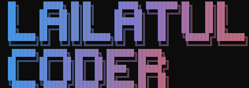

# LailatulCoder Ai

> An open-source AI coding agent that lives in your terminal — powered by LailatulCoder.Ai



## Features

- 🤖 AI coding assistant in your terminal
- 🔐 Connect with LailatulCoder.Ai API key
- 🔄 Auto-fetch available models from API
- 🌐 Supports Malay & English
- 📁 Read & write files, run commands
- 🔧 Multi-model support
- 💻 Cross-platform — Windows, macOS, and Linux (Intel & Apple Silicon / ARM)

## Requirements

- Node.js v22+ ([download for your OS](https://nodejs.org/en/download))
- LailatulCoder.Ai API key

## Installation

Works the same way on **Windows**, **macOS**, and **Linux** — install globally via npm:

```bash
npm install -g lailatulcoder
```

Then run it from any terminal:

```bash
lailatulcoder
```

<details>
<summary>Platform-specific notes</summary>

- **Windows**: Works in PowerShell, Command Prompt (`cmd.exe`), or Windows Terminal. If Node.js isn't installed yet, grab the LTS installer from [nodejs.org](https://nodejs.org/en/download) or install via `winget install OpenJS.NodeJS.LTS`.
- **macOS**: Install Node.js via the [official installer](https://nodejs.org/en/download), [Homebrew](https://brew.sh) (`brew install node`), or `nvm`. Works on both Intel and Apple Silicon Macs.
- **Linux**: Install Node.js via your distro's package manager, [NodeSource](https://github.com/nodesource/distributions), or `nvm`. Works on both x64 and ARM64.

Clipboard image support and right-click paste (`@teddyzhu/clipboard`), the embedded terminal (`node-pty`), and image rendering (`sharp`) all ship as optional platform-specific dependencies — npm automatically installs the correct native binary for your OS and CPU architecture, no extra setup needed.

</details>

## Update

Get the latest version:

```bash
npm update -g lailatulcoder
```

If that doesn't pick up the newest release, force it directly:

```bash
npm install -g lailatulcoder@latest
```

Check what version you have installed:

```bash
lailatulcoder --version
```

## Uninstall

```bash
npm uninstall -g lailatulcoder
```

This removes the CLI only. Your settings and API key stay at `~/.lailatulcoder/` — delete that folder too if you want a completely clean removal:

- **macOS / Linux**: delete the `~/.lailatulcoder` folder
- **Windows (PowerShell)**: delete the `.lailatulcoder` folder inside `%USERPROFILE%`

## Quick Start

1. Run `lailatulcoder`
2. Type `/auth` to configure your API key
3. Select **LailatulCoder.Ai Authentication**
4. Enter your API key
5. Models will be fetched automatically
6. Start coding!

## Commands

| Command | Description |
|---------|-------------|
| `/auth` | Configure API key |
| `/logout` | Logout and clear API key |
| `/model` | Switch between models |
| `/clear` | Clear conversation |
| `/help` | Show all commands |

## Configuration

Settings are stored in `~/.lailatulcoder/settings.json`

## License

Apache 2.0 — Based on [Qwen Code](https://github.com/QwenLM/qwen-code) by Alibaba Group
